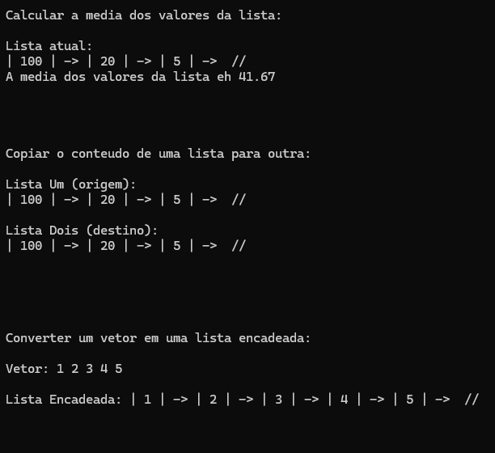
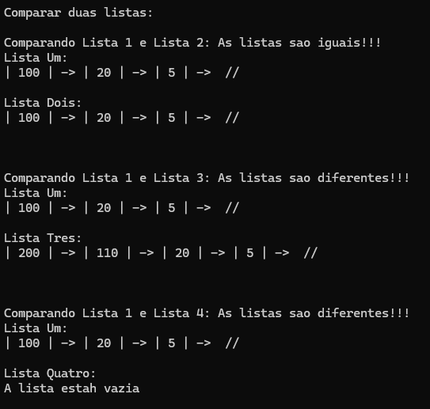

<h1 align="center">Lista Encadeada em C</h1>

<p align="center">
  <strong>Implementação de uma Lista Encadeada em C com alocação dinâmica</strong><br>
  Estrutura de dados que permite inserção no início e no fim, com funções para média, cópia, conversão de vetor e comparação.
</p>

## Tópicos

- [Sobre o Projeto](#sobre-o-projeto) 
- [Conceito de Lista Encadeada](#conceito-de-lista-encadeada) 
- [Estrutura do Projeto](#estrutura-do-projeto)  
- [Funcionalidades](#funcionalidades)   
- [Tecnologias](#tecnologias)  
- [Como executar o projeto](#como-executar-o-projeto)


# Sobre o Projeto
Este projeto implementa uma **Lista Encadeada** em linguagem C, utilizando alocação dinâmica de memória. O objetivo é demonstrar os conceitos de estrutura de dados, manipulação de nós e operações básicas de listas. O código está organizado com separação entre arquivos de cabeçalho (`.h`) e implementação (`.c`).

Os valores testados no programa são **pré-definidos no código** para demonstrar as funcionalidades da lista, incluindo inserção no início, inserção no fim, remoção, média dos elementos, cópia entre listas, conversão de vetor para lista e comparação entre listas.

# Conceito de Lista Encadeada

Uma lista encadeada é uma estrutura de dados linear onde cada elemento (nó) contém um valor e um ponteiro para o próximo elemento. Diferente de um vetor, os elementos não ocupam posições contíguas na memória, permitindo inserções e remoções dinâmicas sem realocação de toda a estrutura.

A **lista encadeada** não possui um tamanho máximo pré-definido, podendo crescer conforme a necessidade, utilizando alocação dinâmica de memória.


# Estrutura do Projeto

```
lista-encadeada/
├── include/
│   ├── lista.h         # Estrutura da lista e protótipos
│   └── no.h            # Estrutura do nó para lista encadeada
├── src/
│   ├── main.c          # Programa principal com testes
│   ├── lista.c         # Implementação das operações da lista
│   └── no.c            # Implementação dos nós
├── readme-img/
│   ├── resultado1.png  # Imagem da execução - parte 1
│   └── resultado2.png  # Imagem da execução - parte 2
├── .gitignore
└── CMakeLists.txt      # Configuração do CMake para CLion

```

### `include/`

#### `lista.h`
- Define a estrutura `t_lista` com ponteiro para o primeiro nó e contador `tamanho`
- Protótipos das funções:
  - `inicializa_lista` - Inicializa a lista vazia
  - `esta_vazia` - Verifica se a lista está vazia
  - `insere_inicio` - Insere elemento no início da lista
  - `insere_fim` - Insere elemento no final da lista
  - `remove_inicio` - Remove elemento do início da lista
  - `remove_fim` - Remove elemento do final da lista
  - `mostra_lista` - Exibe todos os elementos da lista
  - `media_lista` - Calcula a média dos elementos
  - `copiar_lista` - Copia uma lista para outra
  - `vetor_para_lista` - Converte vetor em lista encadeada
  - `comparar_lista` - Compara duas listas

#### `no.h`
- Define a estrutura `t_no` para os nós da lista encadeada
- Protótipo da função `constroi_no` para criação dinâmica de nós

### `src/`

#### `main.c`              
- Programa principal que demonstra o uso da lista encadeada
- **Valores pré-definidos:** Inserções de 5, 20 e 100 no início
- Realiza testes de média, cópia, conversão de vetor e comparação

#### `lista.c`       
- Implementação das funções de manipulação da lista encadeada

#### `no.c`       
- Implementação da criação e gerenciamento dos nós


# Funcionalidades
- ✅ **Inicialização** da lista encadeada (vazia)
- ✅ **Inserir no início** - Adiciona elemento no início da lista
- ✅ **Inserir no fim** - Adiciona elemento no final da lista
- ✅ **Remover do início** - Remove elemento do início da lista
- ✅ **Remover do fim** - Remove elemento do final da lista
- ✅ **Verificação** se a lista está vazia
- ✅ **Exibição** visual do conteúdo atual da lista
- ✅ **Cálculo da média** dos elementos da lista
- ✅ **Cópia** de uma lista para outra
- ✅ **Conversão** de vetor para lista encadeada
- ✅ **Comparação** entre duas listas
- ✅ Alocação dinâmica de memória para cada novo elemento


# Tecnologias
<table align="center">
     <tr>
        <th>
            Linguagem
        </th>
        <td>
            
        </td>
    </tr>
     <tr>
        <th>
            IDE
        </th>
        <td>
            
        </td>
     </tr>
     <tr>
        <th>
            Build System
        </th>
        <td>
            
        </td>
     </tr>
</table>


# Como executar o projeto

### Opção 1: CLion (Recomendado)

1. Clone este repositório:
```bash
git clone https://github.com/pedro-Trovo/lista-encadeada
```

2. Abra o CLion e selecione **File → Open**

3. Escolha a pasta do projeto `lista-encadeada`

4. O CLion irá automaticamente:
   - Detectar o arquivo `CMakeLists.txt`
   - Executar o CMake
   - Criar a configuração de build

5. Clique no botão **▶️ (Run)** no canto superior direito

6. O programa será executado e os resultados aparecerão no terminal integrado do CLion

### Opção 2: Terminal com GCC

1. Clone este repositório:
```bash
git clone https://github.com/pedro-Trovo/lista-encadeada
```

2. Acesse a pasta do projeto:
```bash
cd lista-encadeada
```

3. Compile o projeto com gcc:
```bash
gcc -o lista src/main.c src/lista.c src/no.c -Iinclude
```

4. Execute o programa:
```bash
# Windows
lista.exe

# Linux/Mac
./lista
```

### Opção 3: Terminal com CMake

```bash
mkdir build && cd build
cmake ..
make
./lista
```


# Imagens do Projeto

<div align="center">
  
  <br>
  <em>Execução da lista encadeada no terminal - Parte 1</em>
  <br><br>
  
  <br>
  <em>Execução da lista encadeada no terminal - Parte 2</em>
</div>
